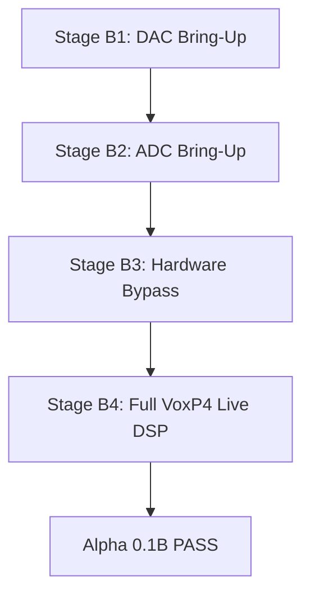

# WT9932P4-TINY + PCM1808 + PCM5102 Hardware Audio Architecture & Bring-Up

This document serves as the technical reference for the real hardware audio transport of VoxP4 Alpha 0.1B on the **Wireless-Tag WT9932P4-TINY** development board using the **Texas Instruments PCM1808 ADC** and **Burr-Brown / TI PCM5102A DAC**.

---

## 1. System Architecture & Clock Tree

### 1.1 Single Clock Domain (ESP32-P4 Master)
To avoid sample rate drift, clock jitter, and buffer under/overflows between capture and playback, the ESP32-P4 operates as the sole clock master for both ADC and DAC.

```text
Target Parameters:
  Sampling Rate (Fs):    48,000 Hz
  Frame Rate (LRCK):     48,000 Hz
  Audio Channels:        2 (Stereo)
  Slot Width:            32 bits per slot
  Slots per Frame:       2 (Left + Right)
  Bit Clock (BCLK):      48,000 × 2 × 32 = 3.072 MHz (64 BCLK / frame)
  Master Clock (MCLK):   256 × Fs = 12.288 MHz
```

### 1.2 ESP32-P4 Clock Source
### 1.2 ESP32-P4 Clock Source Policy
- **Preferred Audio Clock Source:** `I2S_CLK_SRC_APLL`
- **Fallback Audio Clock Source:** `I2S_CLK_SRC_XTAL`
- **Status in ESP-IDF v5.3:** In the current target tree, `SOC_I2S_SUPPORTS_APLL` is reserved (`// TODO: IDF-8884` in `soc_caps.h`). The driver dynamically attempts APLL initialization, checks the return status, cleanly falls back to XTAL, and emits:
  `AUDIO CLOCK WARNING: APLL unavailable, using XTAL fractional clock`
- **XTAL Fractional Clock Synthesis:** ESP-IDF's precise fractional divider (`hal_utils_calc_clk_div_frac_accurate`) divides the 40 MHz clock to synthesize 12.288 MHz MCLK.
  - Fractional division: `40,000,000 / 12,288,000 = 3.255208...`
  - Integer division: `bclk_div = mclk / bclk = 12,288,000 / 3,072,000 = 4` (exact integer).
- **Mandatory Boot Log Records:**
  `requested Fs: 48,000 Hz`
  `actual/configured clock source: SOC_MOD_CLK_XTAL`
  `source clock Hz: 40,000,000 Hz`
  `MCLK Hz: 12,288,000 Hz`
  `BCLK Hz: 3,072,000 Hz`
  `LRCK/Fs: 48,000 Hz`
  `MCLK/Fs ratio: 256`
  `BCLK/Fs ratio: 64`

---

## 2. Pin Assignments — WT9932P4-TINY

All pins are assigned to the WT9932P4-TINY **LEFT HEADER**:

| Header Pin | ESP32-P4 GPIO | Signal Name | Destination / Direction | Function |
|---|---|---|---|---|
| **Pin 4** | **GPIO19** | **MCLK** | Output ──► PCM1808 SCKI | 12.288 MHz Master Clock |
| **Pin 5** | **GPIO20** | **BCLK** | Output ──► PCM1808 & PCM5102 BCK | 3.072 MHz Bit Clock |
| **Pin 6** | **GPIO21** | **WS / LRCK** | Output ──► PCM1808 & PCM5102 LRCK | 48 kHz Frame / Word Select |
| **Pin 7** | **GPIO22** | **DOUT** | Output ──► PCM5102 DIN | Serial Audio Data to DAC |
| **Pin 8** | **GPIO23** | **DIN** | Input ◄── PCM1808 DOUT | Serial Audio Data from ADC |
| **Pin 9** | **GND** | **GND** | Common Ground | Reference GND for all modules |

> [!CAUTION]
> - GPIO37 and GPIO38 must **NEVER** be used for audio.
> - Strapping pins must be avoided.
> - Centralized definition: `components/vocal_fx/platform/boards/wt9932p4_tiny_audio.h`.

---

## 3. Codec Operating Modes

### 3.1 PCM1808 Stereo 24-bit ADC
- **Role:** Slave (ESP32-P4 supplies MCLK, BCLK, LRCK).
- **Format:** Standard Philips I2S, 24-bit.
- **Straps (Must be checked on hardware):**
  - `MD1 = 0 (GND)`
  - `MD0 = 0 (GND)`
  - `FMT = 0 (GND)`
- **Data Placement:** In a 32-bit slot, the 24 audio bits are delivered MSB-first starting 1 BCLK cycle after LRCK transition. In the receiver's 32-bit container, bits [31:8] hold the 24-bit two's complement value, while bits [7:0] are trailing bits. Because bit 31 is the sign bit, the 32-bit integer is already naturally sign-extended!

### 3.2 PCM5102 / PCM5102A Stereo DAC
- **Role:** Slave (receives BCLK, LRCK, DOUT).
- **Clock Mode:** 3-wire operation using internal PLL clock generation from BCLK.
- **SCK Pin:** Grounded on the breakout board. **Do NOT drive SCK with MCLK.**
- **Format:** Standard Philips I2S.
- **Pins / Jumpers:**
  - `FMT = LOW (I2S)`
  - `FLT = LOW (Normal FIR)`
  - `DMP = LOW (De-emphasis off)`
  - `XMT = HIGH (3.3V Unmute)`

---

## 4. DMA Configuration & Buffering

- **Block Size:** 64 stereo frames (matches internal VoxP4 block size).
- **Descriptor Count:** 6 DMA descriptors.
- **Frames per Descriptor:** 64 frames.
- **Bytes per Descriptor:** `64 frames × 2 channels × 4 bytes = 512 bytes`.
- **Buffer Geometry:**
  - Block Duration: `64 / 48,000 = 1.333 ms`.
  - RX DMA Depth: `6 × 64 = 384 frames`.
  - TX DMA Depth: `6 × 64 = 384 frames`.
  - **DMA buffering capacity:** `8.00 ms` total buffering.
  - **physical/effective latency:** `PENDING_HARDWARE_MEASUREMENT` (measured via Latency Pulse Test with oscilloscope on bench).


---

## 5. Bring-Up Stages Progression



### Stage B1 — PCM5102 DAC-Only Bring-Up
- ADC disconnected.
- Generates synthetic tones (-18, -12, -6 dBFS): 100 Hz, 1 kHz, 10 kHz, L-only, R-only, alternating L/R, channel integrity (L=1kHz / R=2kHz).
- Duration: 5 minutes.
- Acceptance: Clean analog output, zero TX underruns, zero clicks.

### Stage B2 — PCM1808 ADC-Only Bring-Up
- DAC can remain disconnected.
- Computes Peak, RMS, DC offset, min/max, zero counts, clipped counts.
- Captures first 256 words for sample format forensic inspection.
- Acceptance: Clean signal capture, proper bit alignment, zero RX overruns.

### Stage B3 — Hardware Bypass (ADC -> DAC)
- Pure pass-through: `PCM1808 -> Format Conversion -> PCM5102` (NO DSP).
- Duration: 10 minutes continuous.
- Acceptance: Zero RX overruns, zero TX underruns, zero deadline misses.

### Stage B4 — Full VoxP4 Live DSP
- Progressive stage testing:
  1. Dry Only (30s)
  2. Dry + Compressor (30s)
  3. Harmony Isolated (30s)
  4. Harmony + Dry (30s)
  5. Delay (30s)
  6. Reverb (30s)
  7. Delay + Reverb (30s)
  8. Full Chain (10-minute continuous real-time stress test: 2 harmony voices, LPC, Delay, FDN Reverb, Master Limiter).
- Acceptance: Zero overruns, zero underruns, zero NaN/Inf, zero heap leaks, zero watchdog resets.

---

## 6. Failure Classification Taxonomy

When analyzing any anomaly, categorize in the following strict order:

1. **TRANSPORT:** Physical wiring, loose headers, ground loop, signal reflections.
2. **CLOCK:** MCLK frequency inaccuracy, BCLK/WS ratio mismatch, jitter, PLL lock failure.
3. **DMA:** Descriptor starvation, queue overflow/underrun, cache sync issues.
4. **FORMAT:** Bit shift (MSB vs Philips), byte endianness swap, sign extension failure, L/R channel flip.
5. **ADC:** PCM1808 strap misconfiguration (MD0/MD1/FMT), analog power supply noise.
6. **DAC:** PCM5102 mute strap (XMT), charge pump ripple, 3-wire PLL lock failure.
7. **SCHEDULING:** FreeRTOS task preemption, Core 0 / Core 1 priority inversion, flash-cache stall.
8. **DSP:** Arithmetic overflow, NaN/Inf, filter instability.
9. **UNKNOWN:** Unclassified anomaly requiring forensic ring buffer capture.

> [!IMPORTANT]
> Do **NOT** automatically attribute transport or clock glitches to the DSP!
